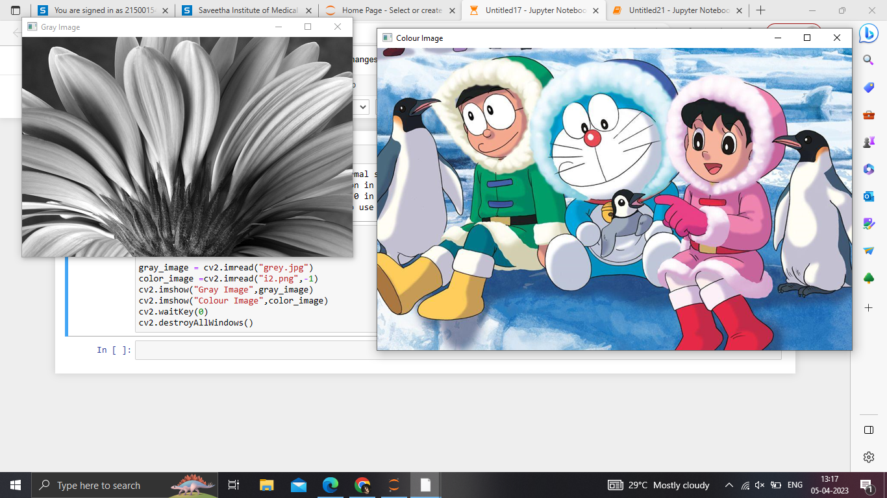
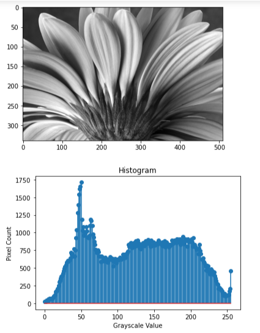
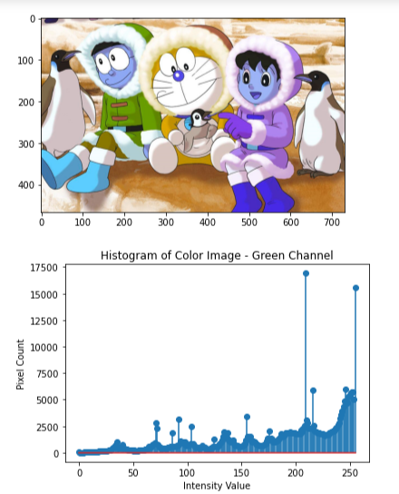
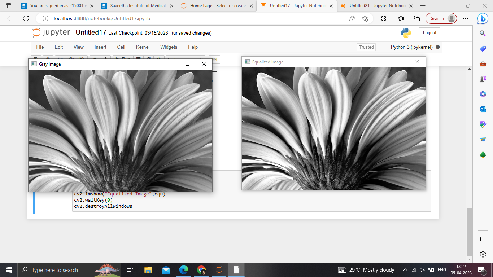

# Histogram and Histogram Equalization of an image
## Aim
To obtain a histogram for finding the frequency of pixels in an Image with pixel values ranging from 0 to 255. Also write the code using OpenCV to perform histogram equalization.

## Software Required:
Anaconda - Python 3.7

## Algorithm:
### Step1:
Import the required libraries and read the image.

### Step 2:
Convert the saved BGR image to RGB using cvtColor().

### Step 3:
Use the filters required for image smoothing and sharpening.

### Step 4:
Apply the filters using cv2.filter2D() for each respective filters.

### Step 5:
Plot the images of the original one and the filtered one using plt.figure() and cv2.imshow().

## Program:
```
Developed By: Dharshini D.S
Register Number: 212221230022

import cv2
import matplotlib.pyplot as plt

# Write your code to find the histogram of gray scale image and color image channels.
gray_image = cv2.imread("gray.jpg")
color_image =cv2.imread("color.png",-1)
cv2.imshow("Gray Image",gray_image)
cv2.imshow("Colour Image",color_image)
cv2.waitKey(0)
cv2.destroyAllWindows()


# Display the histogram of gray scale image and any one channel histogram from color image

gray_image = cv2.imread("gray.jpg")
color_image = cv2.imread("color.png")
gray_hist = cv2.calcHist([gray_image],[0],None,[256],[0,256])
color_hist = cv2.calcHist([color_image],[0],None,[256],[0,256])
plt.figure()
plt.imshow(gray_image)
plt.show()
plt.title("Histogram")
plt.xlabel("Grayscale Value")
plt.ylabel("Pixel Count")
plt.stem(gray_hist)
plt.show()
plt.imshow(color_image)
plt.show()
plt.title("Histogram of Color Image - Green Channel")
plt.xlabel("Intensity Value")
plt.ylabel("Pixel Count")
plt.stem(color_hist)
plt.show()

# Write the code to perform histogram equalization of the image. 

gray_image = cv2.imread("gray.jpg",0)
cv2.imshow("Gray Image",gray_image)
equ = cv2.equalizeHist(gray_image)
cv2.imshow("Equalized Image",equ)
cv2.waitKey(0)
cv2.destroyAllWindows

```
## Output:
### Input Grayscale Image and Color Image


<br>

### Histogram of Grayscale Image and any channel of Color Image



<br>


### Histogram Equalization of Grayscale Image


<br>

## Result: 
Thus the histogram for finding the frequency of pixels in an image with pixel values ranging from 0 to 255 is obtained. Also,histogram equalization is done for the gray scale image using OpenCV.


